  

  

---

## 🖥️ Live Terminal Session

  

---

## 🚀 Featured Projects

<table>
  <tr>
    <td width="50%" valign="top">
      <h3>🔍 <a href="https://github.com/vescofr-oxy/omnilens">OmniLens</a></h3>
      
<b>In-Page Web Intelligence &amp; Diagnostic Suite for Chromium</b>

      
A zero-build, developer tool built with modern ES modules operating in Chrome's side panel. Audits accessibility, inspects layout hierarchy, monitors real-time DOM mutations, and tracks Core Web Vitals.

      

        
        
        
      

    </td>
    <td width="50%" valign="top">
      <h3>🧹 <a href="https://github.com/vescofr-oxy/smart-file-cleaner">Smart File Cleaner</a></h3>
      
<b>Production-Grade Safe Storage Organizer &amp; 3-Tier Dedup</b>

      
Cross-platform CLI tool built for Linux, macOS, and Windows. Eliminates disk bloat with 3-tier hash deduplication, atomic 1-click operation rollback (undo), OS Trash routing, and an interactive triage suite.

      

        
        
        
      

    </td>
  </tr>
</table>

---

## 🛠️ Technical Stack

  
  
  
  
  
  
  

---

## 📊 GitHub Analytics

  
  

---

## 🐍 Contribution Activity

  <picture>
    <source media="(prefers-color-scheme: dark)" srcset="https://raw.githubusercontent.com/vescofr-oxy/vescofr-oxy/output/github-contribution-grid-snake-dark.svg" />
    <source media="(prefers-color-scheme: light)" srcset="https://raw.githubusercontent.com/vescofr-oxy/vescofr-oxy/output/github-contribution-grid-snake.svg" />
    
  </picture>

---

  <small style="color: #71717a;">Engineered with a sharp dark monochrome aesthetic. Zero tracking, zero bloat.</small>

